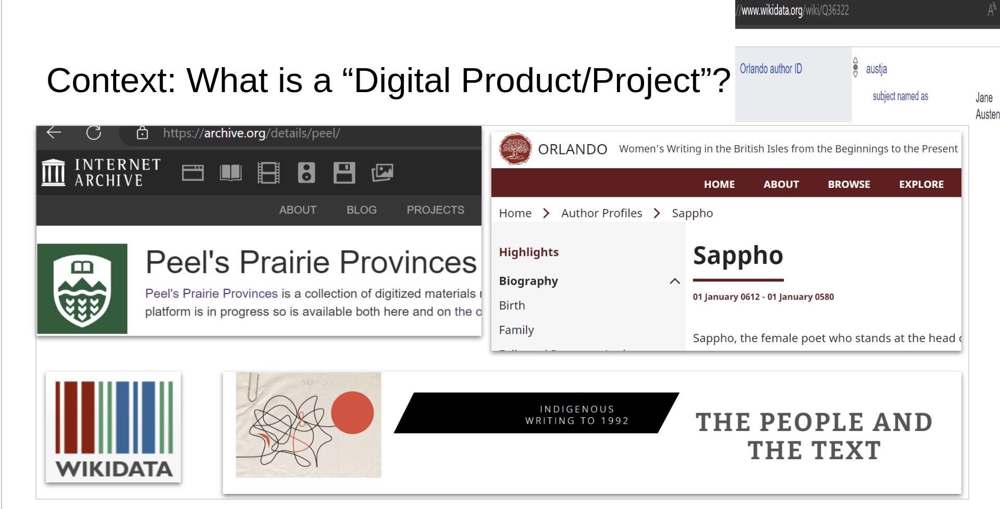
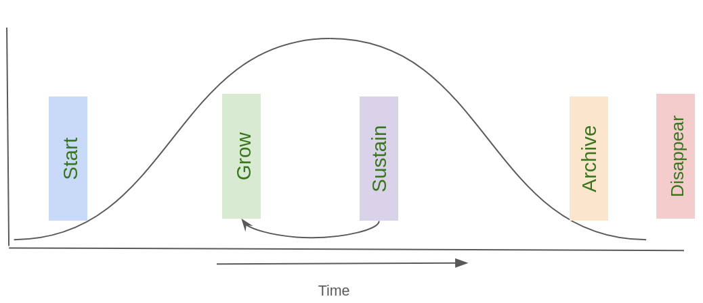
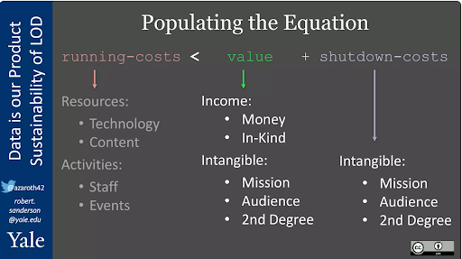
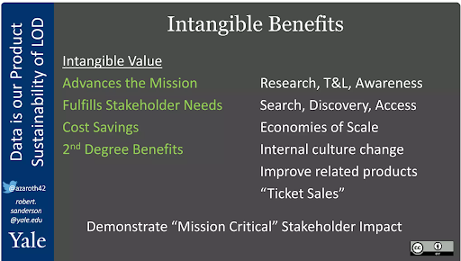
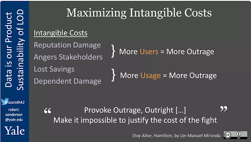
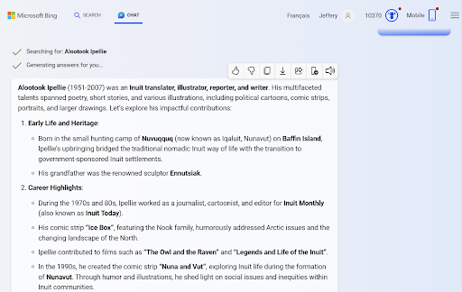
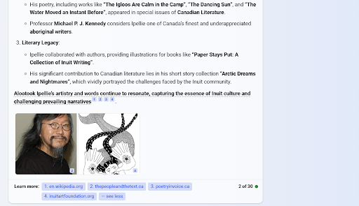

# Sustainability in the Age of Generative AI

> This blog post follows from an UofA Library A/V Club presentation on Feb 9, 2023. This post is the presentation turned into a blog post much later when personal time allowed. The original Markdown is here: <https://github.com/jefferya/jefferya.github.io>.

How do we choose what to sustain in our digital lives? What to archive? What to delete?

## Abstract <!-- omit from toc -->

During the Linking Cultural Data Sustainably Symposium, June 23-24 2022, Dr. Robert Sanderson introduced a framework for deciding whether to sustain a data product/project or not to sustain during the talk "Data is our Product: Thoughts on Sustainability of Cultural Heritage Linked Open Data". Fast-forward to today, 2024, generative AI and LLMs (large language models) are generally available to the world via OpenAI's ChatGPT, Microsoft Copilot, Google, and others. Does the rise of generative AI and large language models (LLM) change how we think about data sustainability and what should be sustained? What are the trade-offs between sustaining versus archiving a data product in a generative AI & LLM world?

Firstly, we talk about the context for the discussion before moving into the framework described by Dr. Robert Sanderson. With this context, this discussion turns to how generative AI is interacting with data products/projects and what the impact of data product/project lifecycle.

## Outline: Sustainability of Digital Products <!-- omit from toc -->

* [Sustainability in the Age of Generative AI](#sustainability-in-the-age-of-generative-ai)
  * [Context: What is a “Digital Product/Project”?](#context-what-is-a-digital-productproject)
  * [Context: Life Cycle](#context-life-cycle)
  * [Decision Framework Thoughts by Dr. Robert Sanderson](#decision-framework-thoughts-by-dr-robert-sanderson)
    * [Sustainability equation: overview \[5\]](#sustainability-equation-overview-5)
    * [Sustainability equation: intangible benefits \[5\]](#sustainability-equation-intangible-benefits-5)
    * [Sustainability equation: intangible costs \[5\]](#sustainability-equation-intangible-costs-5)
  * [Bots and web crawling tools interacting with CWRC sites](#bots-and-web-crawling-tools-interacting-with-cwrc-sites)
  * [AI / LLM tools interacting with DH sites](#ai--llm-tools-interacting-with-dh-sites)
  * [Does the Generative AI world change the decision framework?](#does-the-generative-ai-world-change-the-decision-framework)
  * [Trade-offs between sustain vs. archive in AI / LLM world?](#trade-offs-between-sustain-vs-archive-in-ai--llm-world)
  * [Summary](#summary)

## Context: What is a “Digital Product/Project”?

What do data products/projects like the Peel Prairie Provinces, The Orlando Project, and Wikipedia/Wikidata share? All share a foundation built on a curated data set, whether it be structured assertions like Wikidata, digitized newspapers and other primary sources like Peel or born-digital analytical textual content in narrative forms like Orlando or Wikipedia. In these examples, the software helps to discover and interpret data but is largely ephemeral in that the software is not telling a story, for example, like text analysis software would tell. Data in this context is "Raw material from which information is extracted" (Lucky 1989) with people using the data to build information and obtain knowledge, and wisdom.

 Lucky, R. W. (1989). Silicon dreams : information, man, and machine. Internet Archive. New York : St. Martin's Press. pp. 20–21. ISBN 978-0-312-02960-9.

## Context: Life Cycle

As with life, every data product or project has a beginning and an ending. A project tends to be bound by a defined scope, maybe time or maybe features. Whereas a product could be comprised of one or many time/scope bound projects and as a product, not governed by a time/scope to the same extent as a project.

Both a data product and project have a lifecycle though the product may have a longer timeframe. The main components:

* Beginning / Startup
* Launch / Grow
  * Constraints (e.g., money, time, people, resources) which trigger the next stage
* Sustain / Maintain (?)
  * “Evade the archive” [1] (e.g., project renewal thus may cycle many times between the previous stage and this one)
* Archive / Preserve (?)
* Disappear

A project may skip points 3 or 4 or both depending on project objectives

Beginning: A set of mission, vision, and values is defined to help guide the purpose of the product/project.

What the mission, vision, and values of the project/project define what the lifecycle looks like. For example, a project might only include a digital exhibit meant to represent a snapshot in time, whereas another might have a longer vision of sustained content creation and maintenance. The Endings Project [4] offers a set of principles to enhance the longevity of a project/product. The principles help prepare data for eventual archiving and graceful ending of a project/product, and they also offer guidance for sustaining projects. The Endings Principles help to prepare for the worst but hope for the best if the mission, vision, and values of the data include sustainability.

Taking a step back in the lifecycle, what does the decision landscape look like at the inflection point between the sustain/maintain stage and the preparing for the end stages, archiving and disappearance? How does generative AI and LLMs change the decisions around what to sustain and what to end?

References:

* [1] DHQ: Digital Humanities Quarterly: Published Yet Never Done: The Tension Between Projection and Completion in Digital Humanities Research
* [2] James Cummings, “Embracing sustainability & principles for digital longevity in Digital Humanities” (youtube.com)
* [3] DHQ: Digital Humanities Quarterly: Academics Retire and Servers Die: Adventures in the Hosting and Storage of Digital Humanities Projects
* [4] The Endings Project <https://endings.uvic.ca/principles.html>

## Decision Framework Thoughts by Dr. Robert Sanderson

Dr. Robert Sanderson, Yale University, in his presentation "Data Is Our Product: Thoughts on Sustainability of Cultural Heritage Linked Open Data" at the Linking Cultural Data Sustainably Symposium, June 23-24 2022 proposed a decision framework to help determine what worth sustaining.

The gist of the framework: sustain the data when the "running costs" are less than the "value + shutdown costs"

The video timestamp references for a description better than I can provide.

* Part I: [Intro / Running Costs](https://youtu.be/XojV8m9PttA?si=F0Ys9s09aT3VLzL8&start=0&end=971)
* Part II: [Value + Shutdown Costs](https://youtu.be/XojV8m9PttA?si=F0Ys9s09aT3VLzL8&t=1151)

### Sustainability equation: overview [5]

### Sustainability equation: intangible benefits [5]

### Sustainability equation: intangible costs [5]

References:

* [5] Robert Sanderson, "Data Is Our Product: Thoughts on Sustainability of Cultural Heritage Linked Open Data", Linking Cultural Data Sustainably Symposium June 23-24 2022 [Slides](https://www.slideshare.net/azaroth42/data-is-our-product-thoughts-on-lod-sustainability), [Video](https://www.youtube.com/watch?v=XojV8m9PttA)

## Bots and web crawling tools interacting with CWRC sites

In the age of the popularization of Generative AI, how does the decision framework hold up? First we need to look at how DH sites are being used beyond the human researcher.

CWRC stewards several digital collections and born digital research, many of which are publicly visible.

The type of bots we see crawling CWRC include:

* Web Crawlers
* Search engines
* SEO
* Knowledge bases / linked data
* AI / LLMs

Examples from 2023:

* ChatGPT-User / GPT-Bot / CCBot
* BingChat/Copilot: (leverages search bot, bingBot)
* Google: (leverages search googlebot, Google-Extended)
* Alexa: AmazonBot
* others

What are the options?

* Allow unrestricted access
  * BUT should scholars have protection over the use of their material?
  * BUT this strains IT resources
    * In 2025, the bot traffic to cwrc.ca increased from around 100k per month to 1m per week.
  * BUT bots are not counted by some web analytics tools such as Google Analytics; should bots be included in research impact reports?

* Block bots? Block LLMs?
  * No standard way. Some approaches work for a moment in time until bots evolve to appear more "human" thus circumventing the block
  * Approaches may be All or nothing; not fine-grained like Creative Commmons licenses
  * [How to Block LLM Crawlers (Like ChatGPT's Bot) in 2024 (privacyjournal.net)](https://www.privacyjournal.net/block-llm-crawlers/)

* Legal Protection?
  * In 2023 there was no strong legal precedent
  * [Wikipedia:Large language models and copyright - Wikipedia](https://en.wikipedia.org/wiki/Wikipedia:Large_language_models_and_copyright)
  * [2026 UKSG webinar: The Open Access–AI Conundrum: does free to read mean free to train? ](https://www.uksg.org/events/free-uksg-webinar-the-open-access-ai-conundrum-does-free-to-read-mean-free-to-train/)

## AI / LLM tools interacting with DH sites

An example from 2023 using the Microsoft Bing GenAI query tool. Notice the references at the bottom to the linked project, The People and the Text, one of the CWRC repository-hosted projects. A bot crawled the repository and included material into the LLM to influence the response.

* How to sustain impact of a DH site on an LLM (e.g., Alootook Ipellie query)?
  * What should the content creator know?
* What is the equivalent of SEO in generative AI?
  * Guess: same as practices as good search engine optimization?
  * Or more? LLM => black box
* Or would a researcher be ok with fading AI model relevance?
  * E.g., when others have done a “better” job of boosting the profile of a person/place/org/topic/etc.?
Research impact metrics?

## Does the Generative AI world change the decision framework?

Circling back to Dr. Robert Sanderson's decision framework. Thinking about the demand side, how would generative AI change the evaluation?

Usage statistics:

* Past: humans (e.g., Google Analytics definition)
* Today: include LLMs?
  * User gains access to content via LLM
  * Thus, no indication on website itself of a user!

Audience:

* Do LLMs increase discovery of material?
  * Some explicit Gen AI tools provide links back to the source material, others need to be explicitly asked while others do not.

Cost:

* LLM accuracy/quality suffers as a data product reaches the decline lifecycle stage as site reliability degrades and bots no longer effectively crawl the site

## Trade-offs between sustain vs. archive in AI / LLM world?

A DH site might be archived once it is no longer viable to host on IT infrastructure due to the resources required. An example is via the Internet Archive Wayback Machine and Archive.org. However, the downside is that effort required to update archived content significantly increases. The risk is that an error or outdated piece of information is perpetuated in LLM training data. For example, a DH site like The Orlando Project with biographical and writing career content is regularly updating content as new discoveries and events occur.

The risk, an archived site leads to a decrease in updates/corrections. LLMs train on the outdated material perpetuating the errors. The Internet Archive does not have the equivalent of marginalia, the book/paper practice whereby corrections could be added to reference books.

Efforts toward decolonization are common but are these efforts reflected in LLMs and Gen AI responses? Much has been written in a colonial/settler lens or by the majority throughout history. Efforts toward uplifting the traditionally minoritized voices is recent. With LLMs continuously crawling and updating models, will the traditionally minoritized views be included, minimized, or worse, excluded from Gen AI query responses due to the overwhelming majority view and, for example, perpetuate a colonial/settler view? Should DH a site that aims to advance outdated perceptions of the world be viewed as more valuable on the demand side of the sustainability decision framework?

Trade-offs between sustain/archive/delete in AI / LLM world?

Knowledge is continuously evolving. One can argue that data, information and knowledge move faster today due to Gen AI. Scholarly communication continues to favour the notion of surrogates for paper books and journals but in digital form. These are snapshots in time that are not updated or with luck, revised with a new version. If not revised, are the LLMs being built with outdated knowledge that competes with newer views? Would a site that is continuously updated, "published yet never done" [1], for example, Wikipedia offer a better, more efficient source of training material for an LLM? Would non-updated, archived material cause an LLM to tend to be more stuck in the past? For example, The Orlando Project updated its content to reflect the changes in gender identity terminology from 1990’s to 2020’s.

When should alternatives to archiving a DH site be explored? Are the technologies and workflows that could allow a DH site to have a lower running cost with sustainability planning at the heart of the project, if in the project plan. Can the experimental, cutting-edge nature of a DH site be designed to gracefully degrade to an Endings Project compliant site with features like advanced visualizations gracefully disappearing as resources to support the site decrease while updating continues in some minimal but intuitive workflow?

## Summary

* Intro to a digital product and its life cycle
* Robert Sanderson’s decision framework for sustainability yes/no
  * Running cost < value + shutdown costs
* Generative AI:
  * Interactions with products
  * Impacts the sustainability decision framework
* Sustain versus archive: impacts on LLMs

Ending thought: can digital projects be designed in a more socio-technically sustainable manner? A thought experiment: <https://github.com/jefferya/jefferya.github.io>? Can the heavy-weight full-stack web application that requires a DB server, large application development framework be replaced with a minimal computing or static site generation pattern grounded in the Endings Project Principles? Are there existing tools? At [IslandoraCon 2025](https://youtu.be/jB-7zcLCH68?t=12154), Alexander O'Neill and Rosemary Le Faive introduced [Islandty](https://github.com/alxp/islandty), a tool that leverages Eleventy to takes as input a CSV file of the typical metadata and files hosted in a repository and builds a static site with search IIIF image view not unlike a DSpace or Islandora repository using workflow and templates to build the site. I think Islandty demonstrates the unreleased potential of static site generators in these areas:

* Local procession of digital objects and working software to access the objects that may be hosted non-locally (e.g., Scholaris, CWRC, Aviary). In the spirit of OCAP, reduce the feeling that a centralized "vendor" has possession of the digital object and the software to disseminate via an Ending Project Principles compliant static site provided to the community entrusting stewardship of the digital objects thus preventing the feeling of data hoarding.
* Experimental spaces where people can add tools to a static site, such as visualizations or analytical tools, in such a way to allow gracefully degradation to an Endings Project Principles compliant site. The experimental tools may not be sustainable over time due to lack of sustained support however, the static site remains.
* Narrative storytelling instead of typical digital repository object-oriented organization principles for disseminating digital objects.
* Digital objects brought together from multiple repositories into static site representation
* Do static site generators have a place as a digital exhibit tools whereby the workflow can import items from multiple digital repositories and connect via narrative why maintaining the exhibit in a way that can be updated in the future, beyond the time when the original digital repository software is changed?
